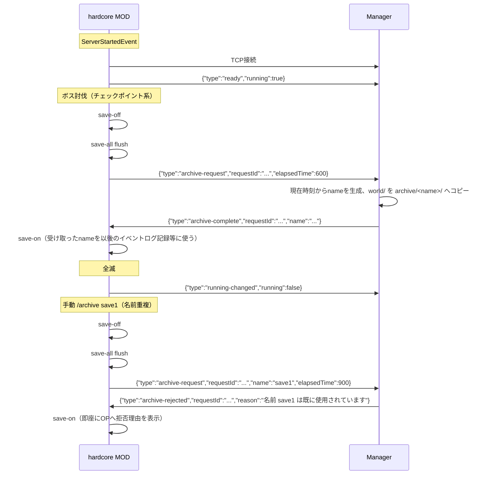

# MOD ⇔ Manager シグナルプロトコル

`specification.md` 6節の詳細版。hardcore MOD（NeoForge、Kotlin/Java）とManager（Go）の間で、hardcoreサーバーの起動完了・状態変化・アーカイブ要求をやり取りするためのプロトコル。

## 1. 前提・トランスポート

| 項目           | 内容                                                                                                       |
| -------------- | ---------------------------------------------------------------------------------------------------------- |
| トランスポート | TCPソケット                                                                                                |
| 待受アドレス   | `127.0.0.1:<signalPort>`（Manager側、Managerの設定ファイルで`signalPort`を指定）                           |
| 接続方向       | hardcore MOD → Manager（MODがクライアント）                                                                |
| 接続タイミング | MODは`ServerStartedEvent`発火時に接続を開始し、成立後直ちに`ready`を送信する                               |
| 再接続         | 接続失敗時は数回リトライ＋バックオフして諦める（ログ出力のみ、致命的エラーにはしない）                     |
| メッセージ形式 | NDJSON（Newline-Delimited JSON）。1メッセージ＝1行のUTF-8 JSONオブジェクト＋`\n`                           |
| 判別方法       | 各メッセージの`type`フィールドで種別を判別する                                                             |
| リクエスト相関 | `archive-request`／`archive-complete`／`archive-rejected`が`requestId`（string、UUID）を持つ（3.3〜3.5節） |
| セキュリティ   | `127.0.0.1`限定リッスンにより、同一コンテナ内通信であることを前提にTLS/認証は行わない                      |

**`requestId`**：hardcore MOD側が`archive-request`ごとに新規発行するUUID文字列。Managerは対応する応答（`archive-complete`または`archive-rejected`）に、受け取った`requestId`をそのままエコーバックする。同一TCP接続上で複数の`archive-request`が並行して未処理になりうる（手動`/archive`実行中にボス討伐による自動アーカイブが割り込む等）ため、応答がどの要求に対応するかを`name`や到着順に頼らず一意に判別できるようにするためのもの（Gate⇔Manager間シグナル〔`protocol-gate-manager.md` 1節〕で採用済みの相関パターンと同じ）。Managerは値の中身を一切解釈せず、受け取った文字列をそのまま運んで返すだけの不透明な値として扱う。`ready`・`running-changed`は応答を伴わない一方向の通知のため`requestId`を持たない。

Managerとhardcoreサーバーは`os/exec`の親子プロセスとして**同一コンテナ内**で動作するため、`127.0.0.1`はコンテナ内ループバックとして解決される。MOD側はこの接続先アドレスを設定ファイルで持つ（Manager側の`signalPort`と値を一致させる必要がある）。

## 2. メッセージ一覧

| `type`             | 方向          | 発生タイミング                                                                                                                                     |
| ------------------ | ------------- | -------------------------------------------------------------------------------------------------------------------------------------------------- |
| `ready`            | MOD → Manager | `ServerStartedEvent`発火時（起動完了直後、1回のみ）                                                                                                |
| `running-changed`  | MOD → Manager | `running`の値が変化するたび（`/start`によるフレッシュ生成時の`true`初期化、全滅/挑戦終了系ボス討伐による`false`化）                                |
| `archive-request`  | MOD → Manager | `/archive <name>`実行時（`name`あり）、または指定ボス討伐等による自動アーカイブ時（`name`省略）（`save-off`→`save-all flush`実行済みの状態で送信） |
| `archive-complete` | Manager → MOD | Managerがワールドフォルダのコピーを完了した時                                                                                                      |
| `archive-rejected` | Manager → MOD | `archive-request`の`name`が既存アーカイブと重複していた場合（1回限りの通知）                                                                       |

## 3. メッセージ詳細

### 3.1 `ready`

MOD → Manager。起動完了を通知し、Managerが保持する`running`キャッシュの初期値を渡す。

| フィールド | 型     | 必須 | 説明                                                                                 |
| ---------- | ------ | ---- | ------------------------------------------------------------------------------------ |
| `type`     | string | ✓    | 固定値 `"ready"`                                                                     |
| `running`  | bool   | ✓    | 起動直後の`running`値（`SavedData`から読み込んだ値、またはフレッシュ生成時は`true`） |

```json
{ "type": "ready", "running": true }
```

### 3.2 `running-changed`

MOD → Manager。`running`フラグが変化するたびに送信する。

| フィールド | 型     | 必須 | 説明                       |
| ---------- | ------ | ---- | -------------------------- |
| `type`     | string | ✓    | 固定値 `"running-changed"` |
| `running`  | bool   | ✓    | 変化後の`running`値        |

```json
{ "type": "running-changed", "running": false }
```

### 3.3 `archive-request`

MOD → Manager。`save-off`→`save-all flush`実行後に送信し、Managerによるワールドコピーを要求する。

| フィールド    | 型     | 必須 | 説明                                                                          |
| ------------- | ------ | ---- | ----------------------------------------------------------------------------- |
| `type`        | string | ✓    | 固定値 `"archive-request"`                                                    |
| `requestId`   | string | ✓    | UUID（1節）                                                                   |
| `name`        | string | 任意 | アーカイブ名。OPが指定した値。**省略した場合はManagerが自動生成する**（後述） |
| `elapsedTime` | int64  | ✓    | 経過時間（秒数、long）                                                        |

```json
{ "type": "archive-request", "requestId": "a1b2c3d4-0000-0000-0000-000000000001", "elapsedTime": 600 }
```

```json
{ "type": "archive-request", "requestId": "a1b2c3d4-0000-0000-0000-000000000002", "name": "save1", "elapsedTime": 600 }
```

`createdAt`は含めない：作成日時はMODの送信内容に依存せず、**Manager自身が`archive-request`処理時点の現在時刻から生成する**（`meta.json`へ書き込む値、`specification.md` 3.2節）。MOD・Managerは同一コンテナ上で動作し（1節）クロックが共有されるため、MOD側で改めて計測・送信する意味が無い。

**`name`の有無による生成元と名前重複時の挙動の分岐**：（`specification.md` 3.2節。手動/自動を区別する専用フィールドは持たず、`name`が送られているかどうかだけで一意に決まる）

- **`name`を送った場合**（手動`/archive <name>`）：MODが送った`name`をそのまま使う。`archive/<name>/`が既に存在する場合は拒否する（上書きしない）。MODはこれをOPへ「その名前は既に使われています」と表示する
- **`name`を省略した場合**（ボス討伐等による自動アーカイブ）：**Managerが`archive-request`処理時点の現在時刻から`name`を生成する**（`createdAt`と同じタイムスタンプ、`2026-07-18T12-34-56`形式）。同一秒内に複数のボスが討伐される稀なケースに備え、衝突時はManager側で末尾に連番を付与して回避する（`2026-07-18T12-00-00-2`等）。失敗させずに継続させる

`name`を省略した場合、MODは`archive-request`送信時点で最終的な`name`を知らない。Managerが実際に採用した名前（連番付与後を含む）は`archive-complete`の`name`で通知するので、MODはそれを使う（3.4節）。

`deadPlayerUUID`は含めない（死亡記録は挑戦記録データ側〔`specification.md` 5.5節〕へ完全移行済みのため不要）。

### 3.4 `archive-complete`

Manager → MOD。ファイルコピー完了を通知する。MODはこれを受けて`save-on`を実行する。

| フィールド  | 型     | 必須 | 説明                                                                                                                                                                                              |
| ----------- | ------ | ---- | ------------------------------------------------------------------------------------------------------------------------------------------------------------------------------------------------- |
| `type`      | string | ✓    | 固定値 `"archive-complete"`                                                                                                                                                                       |
| `requestId` | string | ✓    | 対応する`archive-request`の値をそのままエコー（1節）                                                                                                                                              |
| `name`      | string | ✓    | **Managerが実際に採用した最終的なアーカイブ名**（連番付与済みの場合はそれを含む）。`archive-request`で`name`を送っていた場合は通常それと一致する。省略していた場合、MODはこの値で初めて名前を知る |

```json
{ "type": "archive-complete", "requestId": "a1b2c3d4-0000-0000-0000-000000000001", "name": "2026-07-18T12-00-00" }
```

### 3.5 `archive-rejected`

Manager → MOD。`archive-request`の`name`が既存アーカイブと重複していた場合の1回限りの通知。

**背景**：旧設計ではManagerは名前重複を検出しても自身のログに出力するだけで、TCP接続には何も送り返していなかった。MODは`archive-complete`が一定時間（60秒）来ないことをもって失敗と判断するしかなく、その間`/archive`コマンドを実行したサーバーのメインスレッドがブロックされ続ける（実装上コマンドをメインスレッド上で同期的に処理しているため）という実害を伴う不具合が実機で見つかった（`specification.md` 3.2節「`archive-rejected`の追加経緯」）。

| フィールド  | 型     | 必須 | 説明                                                                    |
| ----------- | ------ | ---- | ----------------------------------------------------------------------- |
| `type`      | string | ✓    | 固定値 `"archive-rejected"`                                             |
| `requestId` | string | ✓    | 対応する`archive-request`の値をそのままエコー（1節）                    |
| `reason`    | string | ✓    | 拒否理由（人間可読の文字列。例：`"名前 save1 は既に使用されています"`） |

```json
{ "type": "archive-rejected", "requestId": "a1b2c3d4-0000-0000-0000-000000000002", "reason": "名前 save1 は既に使用されています" }
```

## 4. 応答待ちの規約

MODは`archive-request`送信後、対応する`requestId`を持つ`archive-complete`または`archive-rejected`を受信するまで`save-on`を実行せずに待つ。これにより、コピー中にオートセーブが再開してしまう事態を防ぐ。`requestId`により相関を取るため、同一TCP接続上で複数の`archive-request`が並行して未処理であっても（手動`/archive`実行中に自動アーカイブが割り込む等）取り違えは起きない。

`archive-rejected`受信時、MODは即座に失敗と判断してOPへ`reason`を表示し、`save-on`を実行する（60秒タイムアウトを待つ必要はない）。`archive-complete`・`archive-rejected`のいずれも一定時間届かない場合は、従来通りタイムアウト（目安60秒、要確定）をもって失敗として扱う（接続断など`archive-rejected`自体が届かない異常系のフォールバック）。

## 5. 接続断の扱い

TCP接続が切れた場合、Managerは自身の`os/exec`ハンドルでhardcoreプロセスの生死を確認する。

- **プロセスが生きているのにTCP接続だけが切れている場合**（まれな異常系）：hardcoreの状態を「不明」とみなし、`running`を安全側（`true`扱い）に倒す。これにより`/start`・`/load`が誤って進行中の挑戦を破棄することを防ぐ
- **プロセス自体が終了している場合**：「不明」にはせず、Manager自身がローカルディスクへ永続化している直前の`running`値をそのまま使う（プロセスが無い間は新しい`running-changed`が届きようがないため、「不明」として扱う理由が無い）

旧設計では両者を区別せず一律「不明→`true`」としていたため、**一度もhardcoreを起動したことが無い状態（永続化された値が存在しない）でも`true`扱いになり、`/start`が永遠に拒否され続けるデッドロックがあった**。`running`値の永続化と、この区別により解消した（`specification.md` 2.1節「プロセス状態と`running`の永続化」・3.1節）。

**`/deactivate`・`/start clean`・`/load`によるプロセス停止中は、上記の区別すら行わない**：MODのTCP接続が閉じるタイミング（MOD自身がプロセス終了直前にソケットを閉じる）と、Managerの`os/exec`が実際に子プロセスの終了を検知するタイミング（`cmd.Wait()`の完了）は別々のOS通知であり、どちらが先に届くかの保証が無い。Managerが自ら`process.Stop()`を呼んでいる最中（`phase`が`starting`〈`/start clean`・`/load`の停止フェーズ〉または`stopping`〈`/deactivate`〉）に切断を検知した場合、その切断は予期されたものであり何のシグナルでもない——その操作自身が完了時に`MarkStopped`/`MarkDeactivated`で正確な状態を記録するため、切断ハンドラが`running`を書き換えると、その操作の結果と競合し`running`を誤って`unknown`にしてしまう（`phase==ready`のとき、つまりManager自身が停止を指示していない場合に限り、上記の生死確認に基づく判定を行う）。

## 6. シーケンス例



## 7. 未決事項

- 接続リトライ回数・バックオフ設定値（`specification.md` 10節）
- Managerが`running`値を永続化する状態ファイルの具体的なパス・フォーマット（`specification.md` 2.1節「プロセス状態と`running`の永続化」。`archiveDir`等と同様、Managerの設定ファイルで指定する想定だが未確定）
- **`/archive`コマンドの非同期化**：現状MOD側の`/archive`はサーバーのメインスレッドで`archive-complete`/`archive-rejected`受信までブロックする同期実装になっている。`requestId`導入により複数の`archive-request`が並行して未処理でも相関できるようになったため、コマンドを即座に返し応答受信時に`CommandSourceStack`経由で結果を通知する非同期実装への変更が望ましいが、設計・実装ともに未着手（`architecture-neoforge.md`「未着手・既知の課題」参照）
